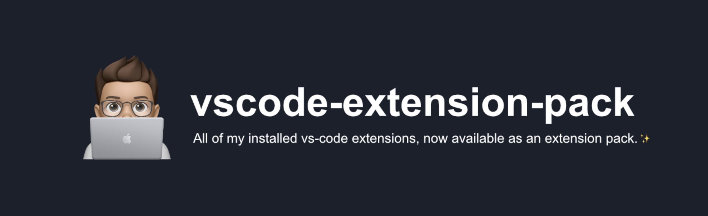

<!-- markdownlint-disable MD033 MD041 -->

[](.)

<div align="center">

[][self]
[][self]
[][self]
[][license]

[](./settings.macos.json)
[](./settings.windows.json)

</div>

---

## Requirements

Make sure these packages are globally installed so that the extensions can work as intended:

```sh
# using npm
npm -g i eslint prettier

# using yarn
yarn global add eslint prettier
```

## License

[Copyright (c) Nicholas Adamou](./LICENSE)

[self]: https://marketplace.visualstudio.com/items?itemName=nicholasadamou.vscode-extension-pack
[license]: https://marketplace.visualstudio.com/items/nicholasadamou.vscode-extension-pack/license
